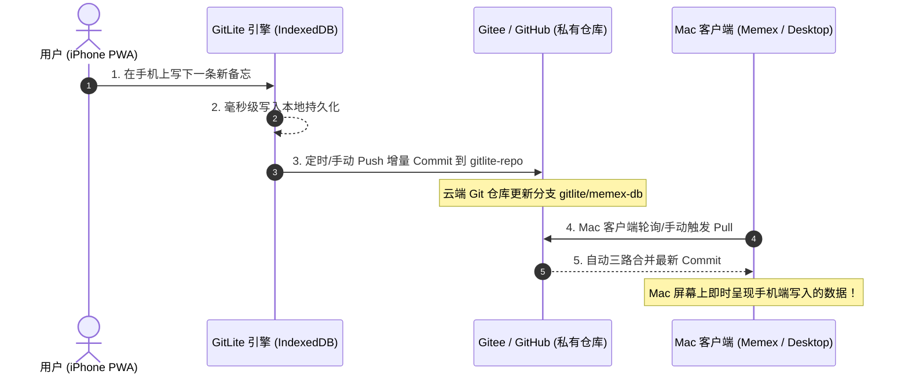

# GitLite PWA 移动端安装与多端实战指南 (iOS / Android)

> 本文档提供将基于 GitLite 的前端应用（如 Vue 3 / React / Memex）**免 App Store 审核、免服务器租用、直接安装到 iPhone / iPad / Android 主屏幕**的完整工程落地流程。

---

## 目录
1. [为什么不能在 iPhone 上“直接本地双击打开 HTML”？](#1-为什么不能在-iphone-上直接本地双击打开-html)
2. [极速实战：2 分钟将应用安装到 iPhone 主屏幕](#2-极速实战2-分钟将应用安装到-iphone-主屏幕)
   - [途径 A：本地局域网 Wi-Fi 直通安装（开发调试最快，免上云）](#途径-a本地局域网-wi-fi-直通安装开发调试最快免上云)
   - [途径 B：免费云端一键发布（全球随时随地打开安装）](#途径-b免费云端一键发布全球随时随地打开安装)
3. [Memex / Vue 3 项目 iPhone PWA 改造实操清单](#3-memex--vue-3-项目-iphone-pwa-改造实操清单)
4. [GitLite 多端云同步验证全流程](#4-gitlite-多端云同步验证全流程)
5. [常见问题与避坑指南 (FAQ)](#5-常见问题与避坑指南-faq)

---

## 1. 为什么不能在 iPhone 上“直接本地双击打开 HTML”？

很多开发者会问：*“既然都是纯静态页面，我能不能把 HTML 文件直接发到微信或放进 iPhone 的文件 App 里双击打开？”*

**答案是：iOS 系统的安全沙箱机制不允许这样做。**

### 物理原因：
1. **协议限制**：在 iPhone 文件 App 里打开 HTML 文件，走的是 `file://` 协议。iOS 会以“只读快速查看 (QuickLook)”沙箱运行，**禁止使用 LocalStorage、IndexedDB 和 Service Worker**（数据无法持久化）。
2. **添加到主屏幕权限**：Apple 规定只有通过 **`http://` 或 `https://` 协议** 访问的网页，Safari 底部菜单才会显示 **「添加到主屏幕」** 选项，并赋予全屏运行（Standalone）的 App 权限。

因此，我们要把应用安装到手机上，只需要让手机 Safari 通过 **本地局域网 HTTP（同一个 Wi-Fi）** 或 **免费的 HTTPS 静态托管** 访问一次即可！

---

## 2. 极速实战：2 分钟将应用安装到 iPhone 主屏幕

### 途径 A：本地局域网 Wi-Fi 直通安装（开发调试最快，免上云）

如果你的电脑和 iPhone 连接在同一个 Wi-Fi（或者 iPhone 连电脑热点）：

#### 步骤 1：电脑启动支持局域网访问的前端服务
以 Vite 项目（如 Memex）为例：
```bash
# 启动时添加 --host 参数，允许局域网设备访问
pnpm dev --host
```
终端会输出如下地址：
```text
  VITE v5.x.x  ready in 300 ms

  ➜  Local:   http://localhost:5173/
  ➜  Network: http://192.168.1.105:5173/   <--- 记录这个局域网 IP
```

#### 步骤 2：iPhone 打开 Safari 访问
1. 打开 iPhone 的 **Safari 浏览器**；
2. 在地址栏输入电脑上的 Network IP 地址（例如 `http://192.168.1.105:5173`）；
3. 确认能正常看到应用界面。

#### 步骤 3：点击「添加到主屏幕」
1. 点击 Safari 底部正中间的 **「分享」按钮**（向上箭头的方框图标）；
2. 向上滑动菜单，找到并点击 **「添加到主屏幕」 (Add to Home Screen)**；
3. 确认应用名称，点击右上角 **「添加」**。

🎉 **大功告成！** iPhone 桌面上会出现一个原生的 App 图标，点击即可**全屏独立启动（无 Safari 网址栏与底部栏）**！

---

### 途径 B：免费云端一键发布（全球随时随地打开安装）

如果你希望离开家里 Wi-Fi 也能随时安装和使用，可以将打包后的静态文件免费托管到各大平台（100% 免费，自带 HTTPS）：

#### 方案 1：Vercel 一键发布（10 秒搞定）
```bash
# 在项目根目录下执行
pnpm build
npx vercel deploy --prod ./dist
```
立即获得一个专属链接（如 `https://my-memex-app.vercel.app`），手机访问即可添加。

#### 方案 2：GitHub Pages 免费托管
1. 将打包后的 `dist` 目录推送到 GitHub 仓库的 `gh-pages` 分支；
2. 在仓库 Settings -> Pages 中开启服务；
3. 手机访问 `https://<your-username>.github.io/<repo>/` 添加到主屏幕。

---

## 3. Memex / Vue 3 项目 iPhone PWA 改造实操清单

要让一个 Vue 3 / React 项目在 iOS 上呈现完美的 App 级沉浸体验，只需确保以下 3 处配置：

### ① 配置 `index.html`（适配 iOS 视口与桌面图标）
在 `<head>` 标签中加入以下代码：

```html
<!-- 1. 允许视口覆盖刘海屏与底部小黑条 -->
<meta name="viewport" content="width=device-width, initial-scale=1, viewport-fit=cover, maximum-scale=1, user-scalable=no" />

<!-- 2. 开启 iOS 全屏 App 模式 -->
<meta name="apple-mobile-web-app-capable" content="yes" />
<meta name="apple-mobile-web-app-status-bar-style" content="black-translucent" />
<meta name="apple-mobile-web-app-title" content="Memex" />

<!-- 3. iOS 桌面图标 (建议 192x192 PNG) -->
<link rel="apple-touch-icon" href="/icon-192.png" />

<!-- 4. PWA Web Manifest 链接 -->
<link rel="manifest" href="/manifest.webmanifest" />
```

---

### ② 编写 `public/manifest.webmanifest`
在 `public/` 目录下创建 `manifest.webmanifest`：

```json
{
  "name": "Memex 记忆中枢",
  "short_name": "Memex",
  "description": "基于 GitLite 的个人记忆与技能管理中枢",
  "start_url": "/",
  "display": "standalone",
  "background_color": "#0e1015",
  "theme_color": "#4f46e5",
  "icons": [
    {
      "src": "/icon-192.png",
      "sizes": "192x192",
      "type": "image/png"
    },
    {
      "src": "/icon-512.png",
      "sizes": "512x512",
      "type": "image/png"
    }
  ]
}
```

---

### ③ 适配 iPhone 全面屏底部横条 (Safe Area Insets)
在项目的全局 CSS（如 `style.css` 或 TailwindCSS）中添加底部安全区，防止 iPhone 底部 Home 条遮挡按钮：

```css
/* 适配全面屏底部与顶部刘海 */
body {
  padding-top: env(safe-area-inset-top, 0px);
  padding-bottom: env(safe-area-inset-bottom, 0px);
  padding-left: env(safe-area-inset-left, 0px);
  padding-right: env(safe-area-inset-right, 0px);
}

/* 按钮点击防延迟与触控优化 */
button, a {
  touch-action: manipulation;
  -webkit-tap-highlight-color: transparent;
}
```

---

## 4. GitLite 多端云同步验证全流程

完成安装后，你就可以体验 **iPhone ↔ Mac / Windows 双向无缝漫游**：



### 实测验证步骤：
1. **手机端连接**：在 iPhone 上打开添加到主屏幕的 App，点击顶部的 GitLite 状态胶囊，登录你的 Gitee / GitHub 账号；
2. **手机端写数据**：在手机上新建一条备忘录或技能卡片；
3. **点击同步**：点击状态胶囊旁边的 `⚡ 立即同步`（或等待 10 分钟自动打包）；
4. **Mac 端查验**：在 Mac 上打开 Memex 或终端，执行数据拉取，数据瞬间同步到达！

---

## 5. 常见问题与避坑指南 (FAQ)

### Q1: 在 iPhone PWA 模式下断网了还能用吗？
**完全可以！** 
GitLite 采用 **Local-First（本地优先）** 架构。所有读写操作首先发生在手机本地持久化存储（IndexedDB / LocalStorage）中。断网时可以随意增删改查，等手机恢复网络后，GitLite 会自动将期间累积的操作批量打包提交到云端 Git 仓库。

### Q2: 为什么在 Safari 里点击「添加到主屏幕」后，打开还是有 Safari 顶部的地址栏？
请检查：
1. `index.html` 中是否正确包含了 `<meta name="apple-mobile-web-app-capable" content="yes" />`；
2. `manifest.webmanifest` 中是否设置了 `"display": "standalone"`；
3. 必须使用 **iOS 系统自带的 Safari 浏览器** 打开并添加（微信内置浏览器或第三方 Chrome 添加到主屏幕可能受限）。

### Q3: 手机端和电脑端同时修改了同一条数据会冲突丢失吗？
**不会丢失。**
GitLite 内置了字段级三路合并算法（3-way merge）。如果两台设备修改了同一条记录的不同字段（例如电脑修改了标题、手机修改了标签），GitLite 会自动合并保留两者的变动；如果修改了同一个字段，则以本地最新修改优先，并派发 `sync:conflict` 事件记录审计日志。

---
*本文档归属 GitLite 官方生态实战套件。*
